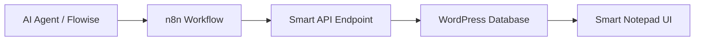

# 🍎 Smart Notepad v2.8

**Smart Notepad** — это высокопроизводительная, эстетически безупречная тема для WordPress, созданная специально для разработчиков и инженеров. Она превращает ваш WP-сайт в профессиональный хаб знаний с полной автоматизацией через n8n.

---

## ✨ Ключевые особенности

- ** Apple Glassmorphism UI:** Минималистичный интерфейс с эффектом размытия фона, шрифтом Inter и мягкими тенями.
- **⚡️ Built-in API:** Скрытый высокоскоростной эндпоинт для мгновенного приема заметок от внешних систем (n8n, Python-скрипты, AI-агенты).
- **📋 Smart Code Copy:** Автоматическое добавление кнопок копирования во все блоки кода с визуальной обратной связью.
- **↕️ Smart Truncation & Scroll:** Длинные заметки автоматически сворачиваются и плавно раскрываются. При сворачивании страница автоматически центрируется на начале карточки.
- **📂 Popup Navigation:** Полноэкранное выпадающее меню в стиле iOS для быстрой навигации по разделам и облаку тегов.
- **🏷️ Auto-Categorization:** Полная поддержка таксономии `note_category` и стандартных WordPress тегов.

---

## 🏗️ Архитектура системы



---

## 🚀 Быстрый старт

### 1. Установка темы
1. Склонируйте этот репозиторий.
2. Скопируйте содержимое папки `theme/` в `/wp-content/themes/smart-notepad/`.
3. Активируйте тему в панели управления WordPress.

### 2. Подготовка WordPress
Тема ожидает наличие типа постов `note`. Убедитесь, что у вас установлен плагин `wp-smart-notepad` или добавлен соответствующий код в `functions.php`.

### 3. Настройка n8n
Для отправки заметки используйте узел **HTTP Request** в n8n:
- **Method:** `POST`
- **URL:** `https://your-site.ru/?api_action=add_note`
- **Body Parameters:**
  - `content`: Текст заметки (поддерживается Markdown и HTML).
  - `tags`: Список тегов через запятую (например: `python,ai,news`).

---

## 🛠 Техническая документация API

### Эндпоинт: `?api_action=add_note`

**Пример запроса на Python:**
```python
import requests

url = "https://your-site.ru/?api_action=add_note"
data = {
    "content": "### Hello World\nThis is a smart note.",
    "tags": "automation,api"
}
response = requests.post(url, data=data)
print(response.json()) # {"status": "success", "post_id": 123}
```

---

## 🎨 Спецификации дизайна

- **Шрифт:** Inter (Google Fonts)
- **Цвета:** 
  - Background: `#f5f5f7` (Apple Gray)
  - Accent: `#0071e3` (Apple Blue)
  - Cards: `rgba(255, 255, 255, 0.7)` with `blur(20px)`
- **Радиус скругления:** `22px`
- **Анимации:** `cubic-bezier(0.4, 0, 0.2, 1)`

---

## 🔐 Безопасность

Тема поставляется с открытым API-приемником. Для использования в продакшене рекомендуется добавить проверку токена в `index.php`:
```php
if ($_SERVER['HTTP_X_API_KEY'] !== 'YOUR_SECRET_KEY') die('Unauthorized');
```

---

**Developed with Gemini CLI & Agent Orchestrator.**
*Maintaining the highest standards of software engineering.*
